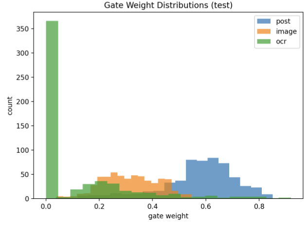

# Multimodal Depression Detection from Social Media Posts Using Text and Images

This project studies depression detection from social media by combining **text, images, and embedded text (OCR)**. It evaluates unimodal models and proposes a multimodal fusion approach that integrates multiple sources of information for more robust classification.

---

## Overview

Mental health signals on social media are rarely expressed through text alone. Users often combine written content with images and visual text, making single-modality approaches incomplete.

This project addresses this by modeling posts as **multimodal inputs**:

- Text (user-written content)  
- Image (visual content)  
- OCR text (text extracted from images)  

Task:

- Binary classification: Depressed / Control  

---

## Dataset

- ~6,000 social media posts  
- Balanced binary labels  
- Each sample includes:
  - post text  
  - image  
  - OCR-extracted text (when present)  

The dataset is constructed to preserve natural user expression while enabling controlled multimodal analysis :contentReference[oaicite:0]{index=0}.

---

## Models

### Text Model

- DistilRoBERTa encoder for post text  
- Uses contextual embeddings for classification  

---

### Image Model

- ResNet-50 backbone  
- Extracts visual features from images  

---

### OCR Model

- Applies the same text encoder to extracted image text  
- Captures additional signals not present in the main post  

---

### Multimodal Fusion Model

The core contribution of this project is a multimodal fusion framework that integrates textual, visual, and OCR-derived signals into a single prediction model. Each modality is first processed independently to extract high-level representations, which are then combined at the feature level.

Text is encoded using a transformer-based model, while images are processed through a convolutional backbone. OCR text is treated as a separate textual modality, allowing the model to capture information embedded directly within images.

Two fusion strategies are explored:

#### 1. Simple Fusion

- Extracts features independently from text and images  
- Projects both modalities into a shared representation space  
- Concatenates the resulting feature vectors  
- Passes the combined representation through a feedforward classifier  

This approach serves as a baseline for multimodal learning. While effective, it assumes that all modalities contribute equally and does not adapt to differences in input quality or relevance.

---

#### 2. 3-Way Gated Fusion (Final Model)

- Combines three modalities:
  - post text (DistilRoBERTa embeddings)  
  - image features (ResNet-50)  
  - OCR text embeddings  

- Each modality is first projected into a common feature space  
- A gating network learns a set of weights for each modality  
- These weights are applied to dynamically scale each representation before fusion  

The final fused representation is computed as a weighted combination of all modalities and passed to the classifier.

This design allows the model to:

- prioritize text when linguistic signals are strong  
- rely more on images when visual cues are dominant  
- leverage OCR when important information is embedded in images  

Unlike simple concatenation, the gated approach adapts to each input instance, making it more robust to missing or noisy modalities and improving overall performance.

---

## Results

### Unimodal Baselines

#### Text-Only

- Accuracy: **0.856**  
- Macro-F1: **0.842**  
- ROC-AUC: **0.921**

Class-wise performance:
- Non-Depressed → Precision: 0.848 | Recall: 0.854 | F1: 0.851  
- Depressed → Precision: 0.836 | Recall: 0.830 | F1: 0.833  

---

#### Image-Only

- Accuracy: **0.692**  
- Macro-F1: **0.691**  
- ROC-AUC: **0.766**

Class-wise performance:
- Non-Depressed → Precision: 0.686 | Recall: 0.781 | F1: 0.731  
- Depressed → Precision: 0.712 | Recall: 0.601 | F1: 0.652  

---

### Multimodal Models

#### Text + Image (No OCR)

- Accuracy: **0.858**  
- Macro-F1: **0.860**  
- ROC-AUC: **0.938**

Class-wise performance:
- Non-Depressed → Precision: 0.833 | Recall: 0.924 | F1: 0.876  
- Depressed → Precision: 0.903 | Recall: 0.793 | F1: 0.845  

---

#### Text + Image + OCR

- Accuracy: **0.861**  
- Macro-F1: **0.862**  
- ROC-AUC: **0.942**

Class-wise performance:
- Non-Depressed → Precision: 0.837 | Recall: 0.921 | F1: 0.877  
- Depressed → Precision: 0.900 | Recall: 0.801 | F1: 0.848  

---

### 3-Way Gated Fusion (Final Model)

- Accuracy: **0.887**  
- Macro-F1: **0.886**  
- ROC-AUC: **0.942**

Class-wise performance:
- Non-Depressed → Precision: 0.894 | Recall: 0.891 | F1: 0.892  
- Depressed → Precision: 0.879 | Recall: 0.882 | F1: 0.880  

---

### Robustness Across Random Seeds

| Model                     | Accuracy        | Macro-F1        | ROC-AUC         | Avg. Precision   |
|--------------------------|---------------|----------------|-----------------|------------------|
| Image-only               | 0.700 ± 0.003 | 0.699 ± 0.004  | 0.770 ± 0.006   | 0.756 ± 0.015    |
| Text-only                | 0.851 ± 0.007 | 0.850 ± 0.007  | 0.927 ± 0.005   | 0.927 ± 0.006    |
| Text + Image             | 0.860 ± 0.008 | 0.859 ± 0.009  | 0.928 ± 0.003   | 0.929 ± 0.004    |
| Text + Image + OCR       | 0.867 ± 0.015 | 0.866 ± 0.016  | 0.934 ± 0.005   | 0.937 ± 0.003    |

### Modality Contribution

The gating mechanism learns to assign different importance to each modality:

- Text dominates when explicit language is present  
- Images contribute when visual context is strong  
- OCR is useful for extracting short but meaningful cues  

This confirms that different modalities contribute differently depending on the input.

---

### Key Takeaways

- Text is the strongest single modality (**0.856 accuracy**)  
- Image-only performs significantly worse (**0.692 accuracy**)  
- Multimodal fusion improves performance over text alone  
- OCR provides a consistent (though smaller) improvement  
- The **3-way gated model achieves the best performance (0.887 accuracy)**  
- Gating produces more balanced class performance compared to standard fusion  
- Results are stable across random seeds, indicating robustness  

---

